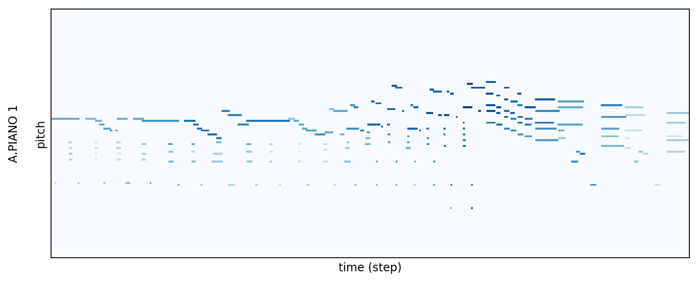
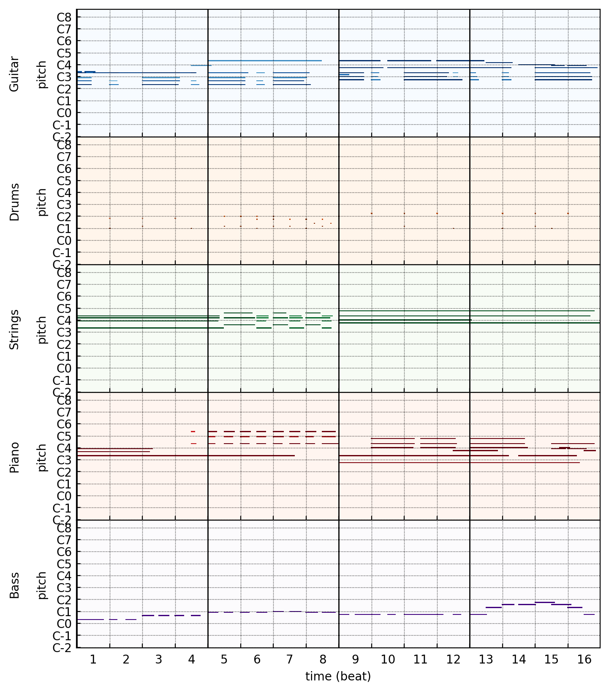

Data Representation
===================

Piano-rolls
-----------

Piano-roll is a music storing format which represents a music piece by a score-like matrix.
The vertical axis represents note pitch, and the horizontal axis represents time.
The time axis can be either in absolute timing or in symbolic timing.
With absolute timing, the actual timing of note occurrence is used.
With symbolic timing, the tempo information are removed and thereby each beat has the same length.

In our work, we use symbolic timing and we set the time resolution of a beat to 24 in order to cover common temporal patterns such as triplets and 16th notes.
The note pitch has 84 possibilities, covering from C1 to C8 (excluded).
For example, a bar in 4/4 time with only one track can be represented as a 96 x 84 piano-roll matrix.

Example piano-roll

Multi-track Piano-rolls
-----------------------

We represent a multi-track music piece with a *multi-track piano-roll*, which is a set of piano-rolls where each piano-roll represents one specific track of the original music piece.
That is, a M-track music piece will be converted into a set of M piano-rolls.
For instance, a bar in 4/4 time with M tracks can be represented as a 96 x 84 x M piano-roll matrix.

Example piano-rolls consisting of five tracks

\* The above piano-roll visualizations are produced with [Pypianoroll](https://salu133445.github.io/pypianoroll/).