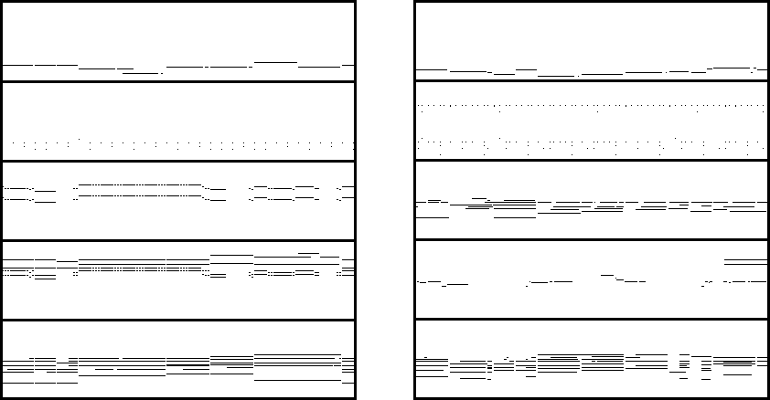

# Data

## Lakh Pianoroll Dataset

We use the _cleansed_ version of
[Lakh Pianoroll Dataset](https://salu133445.github.io/lakh-pianoroll-dataset/)
(LPD). LPD contains 174,154 unique
[multitrack pianorolls](https://salu133445.github.io/lakh-pianoroll-dataset/representation)
derived from the MIDI files in the
[Lakh MIDI Dataset](http://colinraffel.com/projects/lmd/) (LMD),
while the cleansed version contains 21,425 pianorolls that
are in 4/4 time and have been matched to distinct entries in
[Million Song Dataset](https://labrosa.ee.columbia.edu/millionsong/) (MSD).

## Training Data

- Use _symbolic timing_, which discards tempo information
  (see [here](https://salu133445.github.io/lakh-pianoroll-dataset/representation)
  for more information)
- Discard velocity information (using binary-valued pianorolls)
- 84 possibilities for note pitch (from C1 to B7)
- Merge tracks into 5 categories: _Bass_, _Drums_, _Guitar_, _Piano_ and
  _Strings_
- Consider only songs with an _rock_ tag
- Collect musically meaningful 4-bar phrases for the temporal model by
  segmenting the pianorolls with _structure features_ proposed in [1]

Hence, the size of the target output tensor is 4 (bar) &times; 96 (time step)
&times; 84 (pitch) &times; 5 (track).

The following are two sample pianorolls seen in our training data. The tracks
are (from top to bottom): _Bass_, _Drums_, _Guitar_, _Strings_, _Piano_.

## Reference

1. Joan Serrá, Meinard Müller, Peter Grosche and Josep Ll. Arcos,
   "Unsupervised Detection of Music Boundaries by Time Series Structure
   Features,"
   in _AAAI Conference on Artificial Intelligence_ (AAAI), 2012
