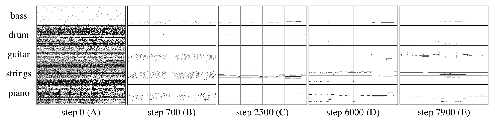

# MuseGAN

**MuseGAN: Symbolic-domain Music Generation and Accompaniment with Multi-track Sequential Generative Adversarial Networks** 
[[arxiv](http://arxiv.org/abs/1709.06298)]
    

# Introduction

Generating music has a few notable differences from generating images and videos. First, music is an art of time, necessitating a temporal model. Second, music is usually composed of multiple instruments/tracks, with close interaction with one another. Each track has its own temporal dynamics, but collectively they unfold over time interdependently. Lastly, for symbolic domain music generation, the targeted output is sequences of discrete musical events, not continuous values. In this paper, we propose and study three generative adversarial networks (GANs) for symbolic-domain multi-track music generation, using a data set of 127,731 MIDI bars of pop/rock music. The three models, which differ in the underlying model assumption and accordingly the network architecture, are referred to as the jamming model, composer model, and hybrid model, respectively. We propose a few intra-track and inter-track objective metrics to examine and compare their generation result, in addition to a subjective evaluation. We show that our models can learn from the noisy MIDI files and generate coherent music of four bars right from scratch (i.e. without human inputs). We also propose extensions of our models to facilitate human-AI cooperative music creation: given the piano track composed by human we can generate four additional tracks in return to accompany it.

System diagram of MuseGAN

# Data

## Lakh Piano-roll Dataset(LPD)

[[lpd-matched](https://drive.google.com/file/d/0Bx-qnQlE_EmsWG1LbVY0MHY5ems/view?usp=drivesdk)]: 115006 midi files from 30887 songs converted into piano-rolls.

[[lpd-full](https://drive.google.com/file/d/0Bx-qnQlE_EmseEtIWGR6WHVoQmM/view?usp=drivesdk)]: 173997 midi files converted into piano-roll.

Please cite the following papers if you use this dataset.

- Colin Raffel. "Learning-Based Methods for Comparing Sequences, with Applications to Audio-to-MIDI Alignment and Matching". PhD Thesis, 2016.

- Hao-Wen Dong, Wen-Yi Hsiao, Li-Chia Yang, Yi-Hsuan Yang. "MuseGAN: Symbolic-domain Music Generation and Accompaniment with Multi-track Sequential Generative Adversarial Networks". arXiv preprint arXiv:1709.06298. 2017.

## Training data

The following are our training data. Please use the provided utilities to load these npz files.

The loaded is a python dictionary. The keys are 'bass', 'drums', 'guitar', 'strings' and 'piano'. The values are the corresponding piano-roll matrices stored  as scipy.sparse.csc_matrix objects.

- [bar.npz](https://drive.google.com/open?id=0Bx-qnQlE_EmsQzdMLXlrT3FDUjg): training data of bars. Please reshape each piano-roll to (-1, 96, 128).

- [phrase.npz](https://drive.google.com/open?id=0Bx-qnQlE_EmsZ19pRnd3TU85S2c): training data of phrases. Please reshape each piano-roll to (-1, 8, 96, 128).

- [sparse_npz.py](https://drive.google.com/open?id=0Bx-qnQlE_EmsMFRISEd2MFJsS3c): utilities for saving/loading multiple scipy.sparse.csc_matrix in one npz file.

# Results

Evolution of the generated piano-rolls as a function of update steps

Randomly-picked generation result (piano-rolls), generating from scratch

# Audio Samples
## Best Samples


## Generation From Scratch
- the *jamming* model


- the *composer* model


- the *hybrid* model


## Track-conditional Generation
- the *jamming* model


- the *composer* model


- the *hybrid* model
