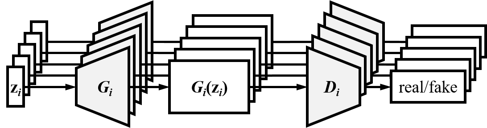
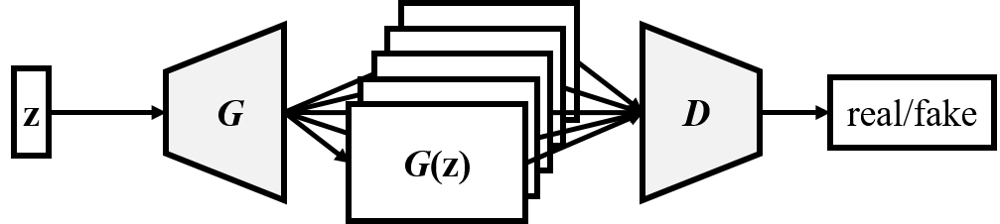
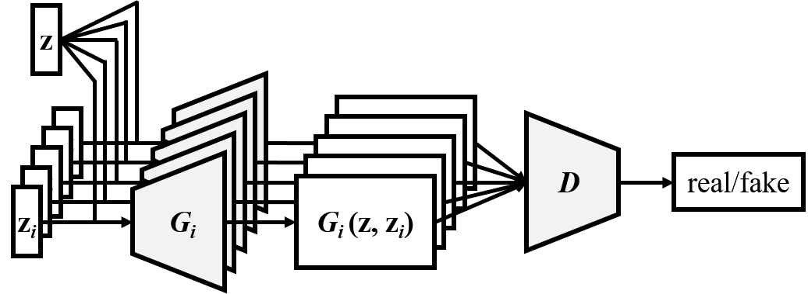
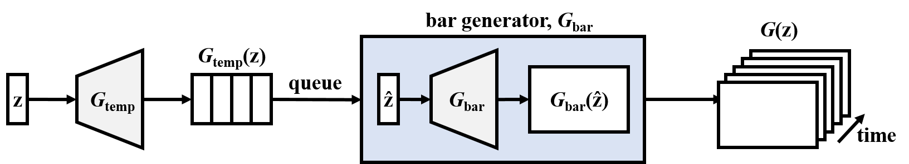
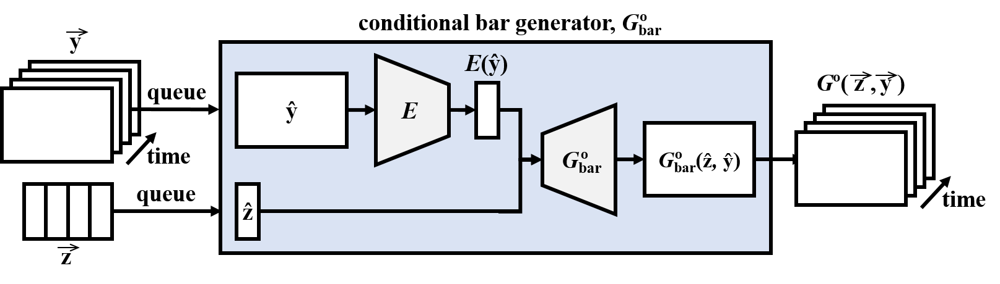
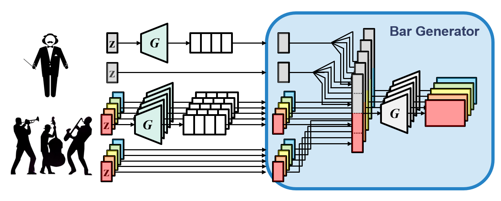
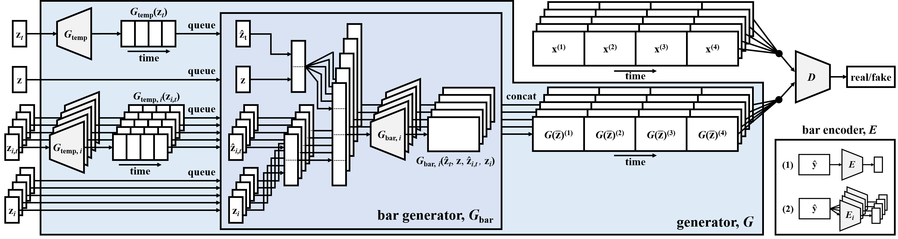

# Model

The MuseGAN model consists of two parts: a _multitrack_ model and
a _temporal_ model. The multitrack model is responsible for the multitrack
interdependency, while temporal model handles the temporal dependency. We
proposed three multitrack models according to three common compositional
approaches. For the temporal model, we proposed one for generation from scratch
and the other for accompanying a track given a priori by the user.

## Modeling Multitrack Interdependency

In our experience, there are two common ways to create music.

- Given a group of musicians playing different instruments, they can create
  music by improvising music without a predefined arrangement, a.k.a. jamming.
- A composer arranges instruments with knowledge of harmonic structure and
  instrumentation. Musicians will then follow the composition and play the
  music.

We design three models corresponding to these compositional approaches.

### Jamming model

Multiple generators work independently and generate music of its own track from
a private random vector <i>zi</i> (_i_ = 1 &hellip; _M_), where _M_
denotes the number of generators (or tracks). These generators receive critics
(i.e. backpropogated supervisory signals) from different discriminators.

### Composer model

One single generator creates a multi-channel pianoroll, with each channel
representing a specific track. This model requires only one shared random vector
_z_ (which may be viewed as the intention of the composer) and one
discriminator, which examines the _M_ tracks collectively to tell whether the
input music is real or fake.

### Hybrid model

Combining the idea of jamming and composing, the hybrid model require _M_
generators and each takes as inputs an inter-track random vector _z_ and an
intra-track random vector <i>zi</i>. We expect that the inter-track
random vector can coordinate the generation of different musicians, namely
<i>Gi</i>, just like a composer does. Moreover, we use only one
discriminator to evaluate the _M_ tracks collectively.

> A major difference between the composer model and the hybrid model lies in the
flexibility&mdash;in the hybrid model we can use different network architectures
(e.g., number of layers, filter size) and different inputs for the _M_
generators. Therefore, we can for example vary the generation of one specific
track without losing the inter-track interdependency.

## Modeling Temporal Structure

### Generation from scratch

The first method aims to generate fixed-length musical phrases by viewing bar
progression as another dimension to grow the generator. The generator consists
of two sub networks, the _temporal structure generator_ <i>Gtemp</i>
and the _bar generator_ <i>Gbar</i>. <i>Gtemp</i> maps a
noise vector to a sequence of some latent vectors, which is expected to carry
temporal information and used by <i>Gbar</i> to generate
pianorolls sequentially (i.e. bar by bar).

### Track-conditional generation

The second method assumes that the bar sequence of one specific track is given
by human, and tries to learn the temporal structure underlying that track and
to generate the remaining tracks (and complete the song). The track-conditional
generator _G_&deg; generates bars one after another with the _conditional bar
generator_, _G_&deg;<i>bar</i>, which takes as inputs the conditional
track and a random noise. In order to achieve such conditional generation with
high-dimensional conditions, an additional encoder _E_ is trained to map the
condition to the space of _z_.

> Note that the encoder is expected to extract inter-track features instead of
intra-track features from the given track, since intra-track features are
supposed not to be useful for generating the other tracks.

## MuseGAN

MuseGAN, an integration and extension of the proposed multitrack and temporal
models, takes as input four different types of random vectors:

- an _inter-track time-independent_ random vector (_z_)
- an _inter-track time-dependent_ random vectors (<i>zt</i>)
- _M intra-track time-independent_ random vector (<i>zi</i>)
- _M intra-track time-dependent_ random vectors (<i>zi, t</i>)

For track _i_ (_i_ = 1 &hellip; _M_), the _shared_ temporal structure generator
<i>Gtemp</i> and the _private_ temporal structure generator
<i>Gtemp, i</i> take the time-dependent random vectors,
<i>zt</i> and <i>zi, t</i>, respectively, as their inputs,
and each of them outputs a series of latent vectors containing inter-track and
intra-track, respectively, temporal information. The output series (of latent
vectors), together with the time-independent random vectors, _z_ and
<i>zi</i>, are concatenated and fed to the bar generator
<i>Gbar</i>, which then generates pianorolls sequentially.

The following is the whole system diagram.

