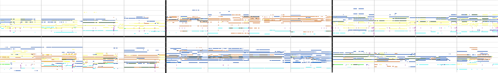

# Results

## Pianoroll Visualizations

Evolution of the generated pianorolls as a function of update steps

Randomly-chosen generated pianorolls (generated from scratch)

## Audio Samples

> __Note that all the audio samples presented below have been downsampled to 4
time steps per beat (originally 24 time steps per beat).__

### Best samples



### Generation from scratch

> No cherry-picking. Some might sound unpleasant. __Lower the volume first!__

| Model    | Sample                                                               |
|:--------:|:--------------------------------------------------------------------:|
| composer |  |
| jamming  |   |
| hybrid   |    |

### Track-conditional generation

> No cherry-picking. Some might sound unpleasant. __Lower the volume first!__

| Model    | Sample                                                                    |
|:--------:|:-------------------------------------------------------------------------:|
| composer |  |
| jamming  |   |
| hybrid   |    |
